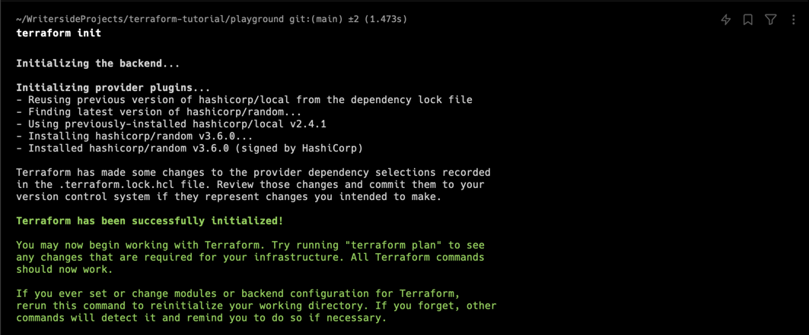

# Multiple Providers

같은 `configuration directory` 에서 여러개의 providers 를 사용할 수 있다.
- 즉, 한 `.tf` 파일에서 여러개의 providers 를 등록할 수 있다.

다음은 앞전 예시에서 사용한, `local` provider 를 사용하는 `pet` resource 이다:

```terraform
resource "local_file" "pet" {
    filename = "root/pets.txt"
    content = "We love pets!"
}
```

이 상태에서, `random` provider 를 사용하는 `my-pet` 을 추가한다:

``` terraform
resource "local_file" "pet" {
    filename = "root/pets.txt"
    content = "We love pets!"
}

resource "random_pet" "my-pet" {
    prefix = "Mrs"
    separator = "."
    length = 1
}
```

`terraform init` 명령어를 실행하여 다음의 output을 확인할 수 있다:



- `- Using previously-installed hashicorp/local v2.4.1` : 기존에 설치된 plugin 은 재설치하지 않는 것을 확인한다.
