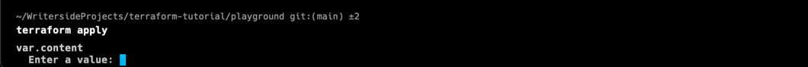

# Understanding Variables in Terraform

`variable`은 세가지 parameter 를 갖는다: default, type, description

세가지 파라미터 모두 optional 이므로 넣지 않아도 된다.

다음은 `variables.tf` 와 `main.tf` 파일이다:

```terraform
# variables.tf

variable "filename" {
}

variable "content" {
}

variable "prefix" {
}

variable "separator" {
}

variable "length" {
}
```

``` terraform
# main.tf

resource "local_file" "pet" {
    filename = var.filename
    content = var.content
}

resource "random_pet" "my-pet" {
    prefix = var.prefix
    separator = var.separator
    length = var.length
}
```

`terraform apply` 를 실행하면 무슨 일이 일어나는가?



사진과 같이 각각의 변수를 직접 입력하는 interactive mode 가 실행된다.

또는 `command line flag`를 통해 변수를 주입할 수 있다:

```Shell
terraform apply -var "filename=/root/pets.txt" -var "content=We love pets!" -var "prefix=Mrs" -var "separator=." -var length=2
```

environmental variables 를 다음과 같이 설정할 수도 있다:

```Shell
export TF_VAR_filename="/root/pets.txt"
export TF_VAR_content="We love pets"
export TF_VAR_prefix="Mrs"
export TF_VAR_separator="."
export TF_VAR_length=2
terraform apply
```

`terraform.tfvars` 파일을 만들어서 변수를 설정할 수도 있다:

```Shell
# variable.tfvars

filename = "/root/pets.txt"
content = "We love pets!"
prefix = "Mrs"
separator = "."
length = 2
```

- 파일의 확장자는 항상 `.tfvars` 또는 `.tfvars.json` 이어야 한다.
- `terraform.tfvars`, `terraform.tfvars.json`, `*.auto.tfvars`, `*.auto.tfvars.json` 파일은 자동으로 로드된다.
- 그 외의 파일은 `terraform apply` 실행 시, `-var-file` flag 를 사용하여 로드할 수 있다.

```Shell
terraform apply -var-file="variable.tfvars"
```

테라폼의 변수를 등록하는 방법이 여러가지가 있기 때문에, 다음과 같은 우선순위로 변수를 로드한다:

1. command line flag (가장 높은 우선순위)
2. `*.auto.tfvars` 또는 `*.auto.tfvars.json`
3. `terraform.tfvars` 또는 `terraform.tfvars.json`
4. environment variables
5. `variable` block 내의 `default` value
6. interactive mode

