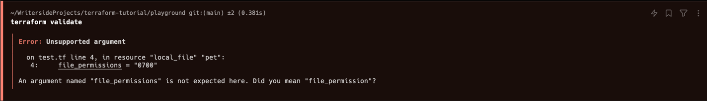
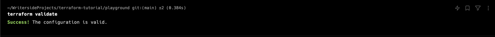
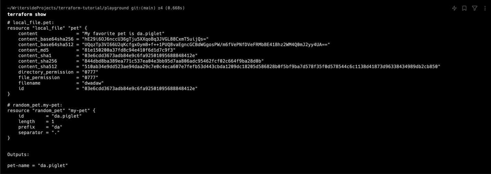
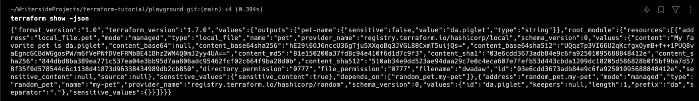
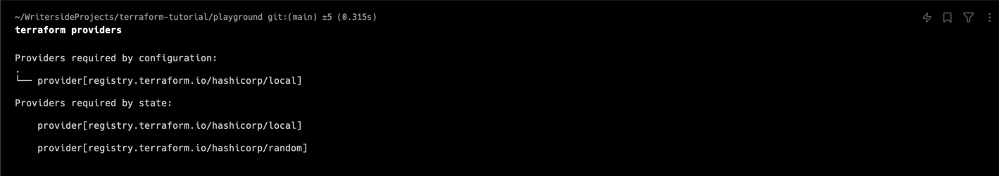
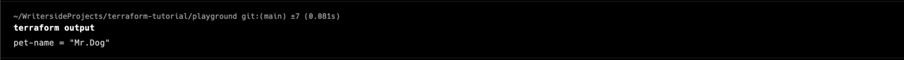
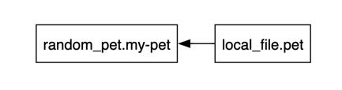

# Terraform Commands

```Shell
terraform init
terraform plan
terraform apply
```

앞서 알아본 명령어들이다.

이 외에도 여러가지 테라폼 명령어가 있는데, 이번 챕터에서는 추가적인 명령어들을 알아보도록 하자.


### terraform validate

`terraform validate` 명령어는 테라폼 파일의 구문을 검증한다.

`terraform plan` 을 수행하지 않더라도, 어떤 부분의 문법이 잘못되었는지 확인할 수 있다.

```terraform
# main.tf

resource "local_file" "pet" {
    filename = "/root/pets.txt"
    content = "We love pets!"
    file_permissions = "0700"
}
```

위 파일에서 `file_permission` 의 attribute 를 잘못 입력하였다.

`terraform validate` 를 실행하면 다음과 같은 결과를 얻을 수 있다:



몇번째 라인이 잘못되었는지 알려준다.

문법이 올바른 경우 다음과 같은 결과를 얻을 수 있다:



### terraform fmt

`terraform fmt` 명령어는 테라폼 파일의 포맷을 정리해준다.

```terraform
# main.tf

resource "local_file" "pet" {
    filename = "/root/pets.txt"
    content = "We love pets!"
    file_permission = "0700"
}
```

위 파일의 상태에서 `terraform fmt` 를 실행하면 다음과 같은 결과를 얻을 수 있다:

```terraform
# main.tf

resource "local_file" "pet" {
  filename        = "/root/pets.txt"
  content         = "We love pets!"
  file_permission = "0700"
}
```

### terraform show

`terraform show` 명령어는 테라폼의 상태를 보여준다.



`terraform show -json` 명령어를 통해 json 형식으로도 출력할 수 있다:



### terraform providers

`terraform providers` 명령어는 configuration directory 에서 사용된 모든 provider 들의 정보를 보여준다:



`terraform providers mirror ./mirror` 명령어를 통해 현재 사용된 모든 provider 들을 `mirror` 디렉토리에 복사할 수 있다.

### terraform output

`terraform output` 명령어는 `output variable` 의 값을 보여준다.

```terraform
# main.tf

resource "local_file" "pet" {
    filename = "/root/pets.txt"
    content = "We love pets!"
    file_permission = "0700"
}

output "pet-name" {
    value = "Mr.Dog"
}
```

위 파일에서 `terraform output` 을 실행하면 다음과 같은 결과를 얻을 수 있다:



`terraform output <output_variable_name>` 명령어를 통해 특정 output 만 따로 출력할 수 있다.

### terraform refresh

`terraform refresh` 명령어는 provider 에 의해 관리되는 리소스의 상태를 갱신한다.

예를 들어, 테라폼으로 구축된 AWS 인프라에서 다른 사용자가 AWS 콘솔을 통해 리소스를 생성하거나 삭제한 경우, 테라폼은 해당 리소스의 상태를 알지 못한다.

이런 경우 `terraform refresh` 명령어를 통해 테라폼의 상태를 갱신할 수 있다.

>`terraform plan` 명령어 수행 시 자동으로 `terraform refresh` 가 수행된다.
> 
> -refresh=false 옵션을 통해 `terraform plan` 명령어 수행 시 `terraform refresh` 를 수행하지 않도록 할 수 있다.


### terraform graph

`terraform graph` 명령어는 테라폼 파일의 의존성을 그래프 형태로 보여준다.

graphviz 를 설치한 후 `terraform graph | dot -Tsvg > graph.svg` 명령어를 통해 그래프를 svg 파일로 출력할 수 있다.

> [!NOTE]  
> MacOS 에서는 `brew install graphviz` 명령어를 통해 graphviz 를 설치할 수 있다. (Homebrew 가 설치되어 있어야 함)

```terraform
# main.tf

resource "local_file" "pet" {
    filename = "/root/pets.txt"
    content = "We love pets!"
    file_permission = "0700"
}

resource "random_pet" "my-pet" {
    prefix = "Mr"
    separator = "-"
    length = 2
}

resource "local_file" "pet" {
    filename = "/root/pets.txt"
    content = "My favorite pet is ${random_pet.my-pet.id}"
    depends_on = [
        random_pet.my-pet
    ]
}

output "pet-name" {
    value = random_pet.my-pet.id
    description = "Record the value of pet ID generated by the random_pet resource"
}

```

해당 파일에 대한 그래프는 다음과 같다:



