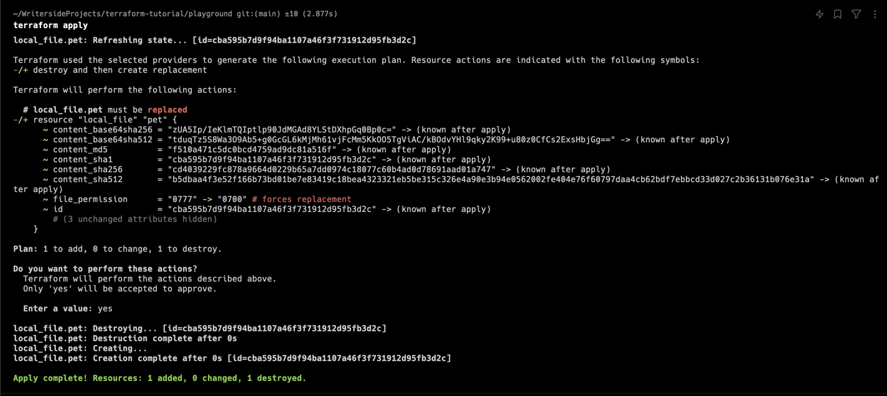

# Mutable versus Immutable Infrastructure

## Immutable Infrastructure

테라폼은 Immutable Infrastructure 를 지향한다.

Immutable Infrastructure 는 서버를 생성한 후에는 서버의 상태를 변경할 수 없다는 것을 의미한다. 

서버의 상태를 변경하고 싶다면, 새로운 서버를 생성하고 기존 서버를 삭제해야 한다.

```terraform
# main.tf

resource "local_file" "pet" {
    filename = "./root/pets.txt"
    content = "We love pets!"
}
```

해당 리소스를 다음과 같이 수정한다:

```terraform
# main.tf

resource "local_file" "pet" {
    filename = "./root/pets.txt"
    content = "We love pets!"
    file_permission = "0700"
}
```

`terraform apply` 를 실행하면 다음과 같은 결과를 얻을 수 있다:



하단에서 보이듯이, 테라폼은 기존의 리소스를 삭제하고 새로운 리소스를 생성한다.


## Configuration Drift

Immutable Infrastructure 를 지향하는 이유는 Configuration Drift 를 방지하기 위함이다.

Configuration Drift 란, 서버의 상태가 변경되어 서버의 상태가 코드와 일치하지 않는 상태를 의미한다.

Mutable Infrastructure 를 사용하는 경우 해당 문제가 발생할 수 있다.

예를 들어, 3개의 인스턴스에서 NGINX 서버의 버전이 1.18.0 에서 1.19.0 으로 변경되어야 한다고 가정하자.

이 때, 3개의 인스턴스 중 2개의 인스턴스는 버전이 변경되었지만, 1개의 인스턴스는 버전이 변경되지 않은 상태라면, 이는 Configuration Drift 라고 할 수 있다.

변경되지 않는 원인은 다양하다.
- OS 환경이 다른 경우
- 인터넷 커넥션 문제
- 인스턴스가 다른 리전에 있는 경우 등

이러한 Configuration Drift 는 서버의 상태를 추적하는 것을 어렵게 만든다.

따라서 테라폼은 Immutable Infrastructure 를 지향하여, 서버의 상태를 변경할 때마다 새로운 서버를 생성하고 기존의 서버를 삭제한다.

