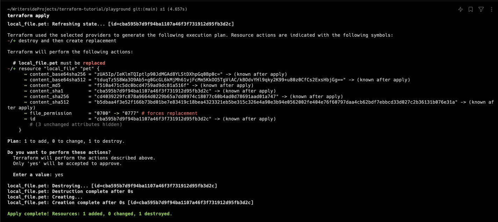
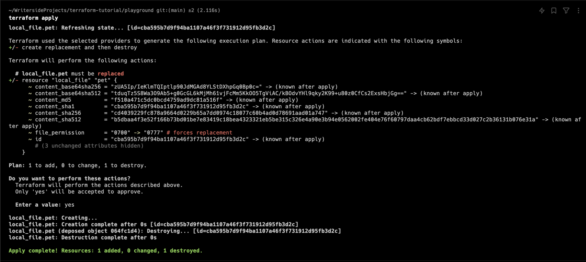
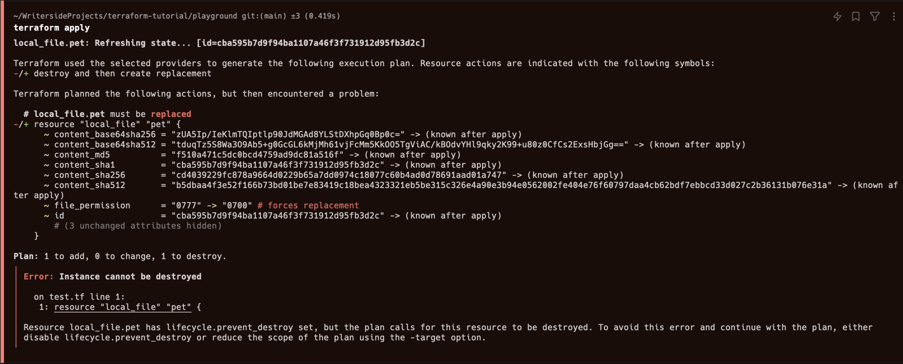

# LifeCycle Rules

## create_before_destroy

지금까지 배운 바로는, 테라폼 리소스의 변경 사항이 있을 때 테라폼은 리소스를 삭제하고 다시 생성한다.

```terraform
resource "local_file" "pet" {
    filename = "./root/pets.txt"
    content = "We love pets!"
    file_permission = "0700"
}
```

이 상태에서, `file_permission` 의 attribute 를 `0777` 으로 변경하면, 테라폼은 기존 파일을 삭제하고 다시 생성할 것이다:


경우에 따라 새로운 리소스를 먼저 생성한 후, 기존이 리소스를 삭제하고 싶을 수 있다.

리소스를 먼저 생성한 후 기존 리소스를 삭제하도록 하려면 다음과 같이 변경한다: 

```terraform
resource "local_file" "pet" {
    filename = "./root/pets.txt"
    content = "We love pets!"
    file_permission = "0777"

    lifecycle {
        create_before_destroy = true
    }
}
```

`lifecycle` 블록을 추가하고, `create_before_destroy` 를 `true` 로 설정한다.



하단을 보면 `local_file.pet`이 먼저 생성되고, 생성 후 삭제된 것을 확인할 수 있다.

> [!CAUTION]
> 해당 예제의 경우 파일을 생성하는 리소스이기 때문에, `create_before_destroy` 를 사용하면 같은 이름의 파일을 생성한 후 그 파일을 삭제한다. 
> 따라서 이 경우엔 `create_before_destroy` 를 사용하지 않는 것이 좋다.

```terraform
resource "random_pet" "my-pet" {
    prefix = "Mrs"
    separator = "."
    length = 1

    lifecycle {
        create_before_destroy = true
    }
}
```

위와 같은 경우처럼 리소스의 삭제가 생성한 리소스에 영향을 주지 않는 경우에 `create_before_destroy` 를 사용하는 것이 좋다.

## prevent_destroy

`prevent_destroy` 는 리소스의 우발적 삭제를 방지한다.

`terraform desetroy` 를 포함한 리소스 삭제 명령을 시도할 시 에러를 발생시킨다.

```terraform
resource "local_file" "pet" {
    filename = "./root/pets.txt"
    content = "We love pets!"
    file_permission = "0777"

    lifecycle {
        prevent_destroy = true
    }
}
```

다음 `local_file` 을 생성한 후, `file_permission` 을 `0700` 으로 변경하고 다시 `terraform apply` 를 실행하면 다음과 같은 결과를 얻을 수 있다:



이처럼 의도치 않은 리소스 삭제를 방지할 수 있다.


## ignore_changes

가령 AWS 리소스를 다루는 경우, 테라폼으로 생성한 리소스를 AWS management console 에서 직접 변경하는 경우가 있다.

이 경우 `terraform apply` 를 다시 실행하면 테라폼은 변경 사항을 다시 돌려놓으려 할 것이다.

이를 원치 않는 경우 특정 attribute 를 변경하지 않도록 설정할 수 있다:

```terraform
resource "aws_instance" "web" {
    ami = "ami-0c55b159cbfafe1f0"
    instance_type = "t2.micro"
    tags = {
      Name = "Example-Webserver"
    }

    lifecycle {
        ignore_changes = [
            tags,
        ]
    }
}
```

다음과 같이 `ignore_changes` 배열에 attribute 를 추가하면, 해당 attribute 에 변경사항이 있더라도 테라폼은 변경사항을 무시한다.

만약 모든 변경사항을 무시하고 싶다면 `ignore_changes = all` 을 입력한다:

```terraform
resource "aws_instance" "web" {
  ami = "ami-0c55b159cbfafe1f0"
  instance_type = "t2.micro"
  tags = {
    Name = "Example-Webserver"
  }

  lifecycle {
    ignore_changes = all
  }
}
```

