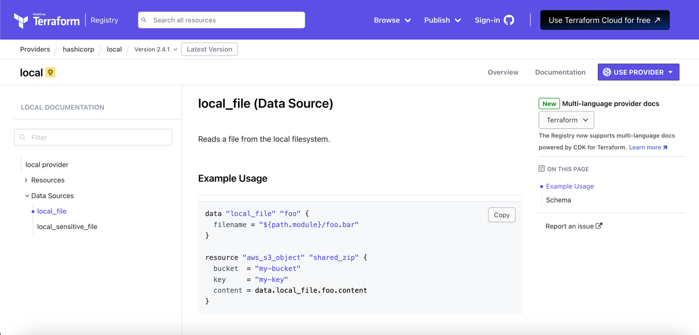

# Datasources

실제로 인프라를 구축하다 보면, 모든 리소스를 테라폼이 관리하지 않을 수 있다.

예를 들어, AWS 의 경우, VPC 를 생성할 때 기존에 생성된 VPC 를 사용할 수 있다.

이럴 때 이미 만들어져 있는 리소스를 참고하여 사용할 수 있는데, 이를 `datasource` 라고 한다.

`datasource` 는 테라폼이 직접 **create**, **update**, **delete** 를 수행하지 않고, 오직 **read** 만 수행할 수 있다.

`datasource` 는 다음과 같이 정의할 수 있다:

```terraform
data "local_file" "pet" {
    filename = "./root/pets.txt"
}
```

- `data` 블록을 사용하여 `datasource` 를 정의한다.
- `local_file` 은 `datasource` 의 이름이다.
- `pet` 은 `datasource` 의 alias 이다.
- `filename` 은 `datasource` 의 attribute 이다.

이제 `datasource` 를 사용하기 위해 다음과 같이 구성할 수 있다:

```terraform
resource "local_file" "cat" {
    filename = "./root/cats.txt"
    content = data.local_file.pet.content
}

data "local_file" "pet" {
  filename = "./root/pets.txt"
}
```

- `content` 는 `local_file.pet` 의 `content` attribute 를 사용한다.
- 해당 예시에서 `cat` 리소스는 `pet` 리소스의 `content` attribute 를 사용한다. 

> [!TIP]
> https://registry.terraform.io/ 에서 `datasource` 의 데이터를 가져오는 방법을 확인할 수 있다.



테라폼에서 `resource` 는 **managed resource** 를, `datasource` 는 **data resource** 를 의미한다.
