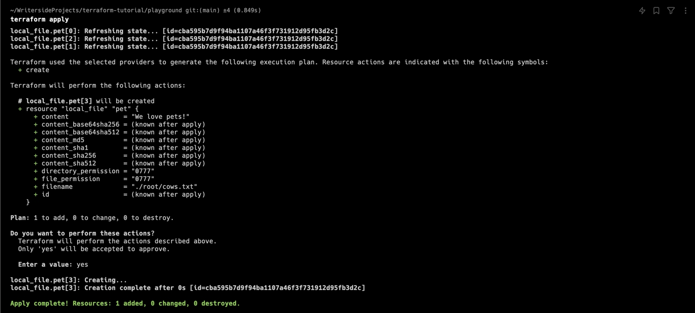
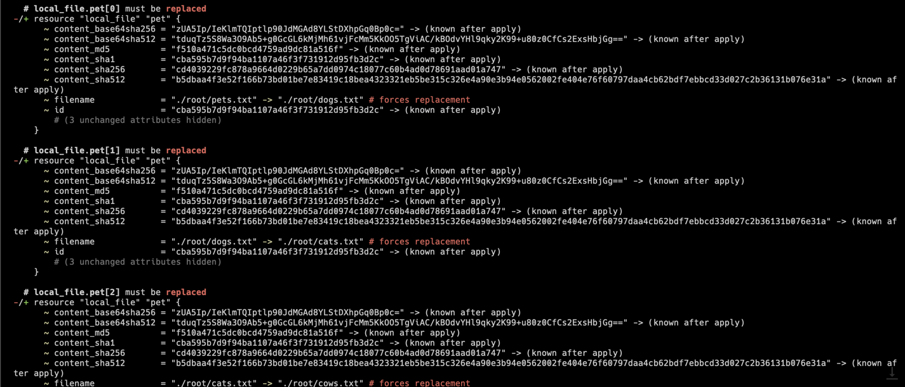
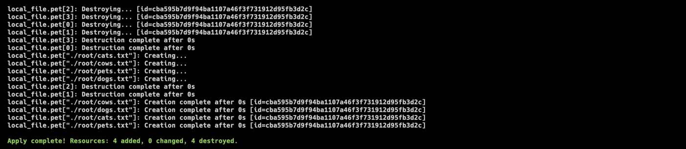

# Meta Arguments

## Meta Arguments

`meta arguments` 는 모든 리소스 블록에서 사용될 수 있는 인수들이다.

앞서 살펴본 `depends_on` 이나 `lifecycle` 또한 `meta arguments` 이다.

## Count

`count` 는 리소스 블록을 여러 번 반복해서 생성할 때 사용한다.

```terraform
resource "local_file" "pet" {
    filename = var.filename
    content = "We love pets!"
    
    count = 3
}

variable "filename" {
    default = "./root/pets.txt"
}
```

위와 같이 `count` 를 3으로 설정하면, `local_file.pet` 리소스 블록이 3번 반복되어 생성된다.


- 다음과 같이 리소스가 `pet[0]`, `pet[1]`, `pet[2]` 와 같이 인덱스를 가지게 된다.

> [!WARNING]
> 해당 예제의 경우, resource 의 이름엔 인덱스를 갖지만 파일의 이름은 인덱스를 갖지 않는다.
> 따라서 파일의 이름이 중복되어 문제가 발생할 수 있다.


다음과 같이 하나의 `pets.txt` 파일만 생성된 것을 확인할 수 있다.

이와 같은 문제를 해결하기 위해 `filename` attribute 에 `count.index` 를 사용할 수 있다.

```terraform
resource "local_file" "pet" {
    filename = var.filename[count.index]
    content = "We love pets!"
    
    count = 3
}

variable "filename" {
    default = [
      "./root/pets.txt",
      "./root/dogs.txt",
      "./root/cats.txt"
    ]
}
```

`filename` variable 을 배열로 선언하고, `count.index` 를 사용하여 각각의 파일 이름을 지정한다.

`terraform apply` 를 실행 후, 다음과 같은 결과를 확인할 수 있다:


위의 예제에서 파일 `./root/cows.txt` 하나를 더 추가해보자:

```terraform
resource "local_file" "pet" {
    filename = var.filename[count.index]
    content = "We love pets!"
    
    count = 4
}

variable "filename" {
    default = [
      "./root/pets.txt",
      "./root/dogs.txt",
      "./root/cats.txt",
      "./root/cows.txt"
    ]
}
```

`./root/cows.txt` 를 추가하기 위해 `count` 를 4로 변경하고, `filename` 에 `./root/cows.txt` 를 추가했다.

하지만 `length()` 를 이용하면 count 를 직접 수정하지 않고도 `filename` 의 길이를 이용하여 파일을 추가할 수 있다.

```terraform
resource "local_file" "pet" {
    filename = var.filename[count.index]
    content = "We love pets!"
    
    count = length(var.filename)
}

variable "filename" {
    default = [
      "./root/pets.txt",
      "./root/dogs.txt",
      "./root/cats.txt",
      "./root/cows.txt"
    ]
}
```

`length()` 는 리스트의 길이를 반환한다.



정상적으로 생성된 것을 확인할 수 있다.

이제 여기서 `./root/pets.txt` 를 삭제해보자.

```terraform
resource "local_file" "pet" {
    filename = var.filename[count.index]
    content = "We love pets!"
    
    count = length(var.filename)
}

variable "filename" {
    default = [
      "./root/dogs.txt",
      "./root/cats.txt",
      "./root/cows.txt"
    ]
}
```

이 상태에서 `terraform plan` 을 실행하면, 다음과 같은 결과를 확인할 수 있다:



리소스를 하나만 삭제했지만, 그 외 다른 파일들 모두 삭제하고 새로 생성하는 것을 확인할 수 있다.

이는 `count` 의 인덱스가 모두 1씩 밀려서 발생하는 문제이다.

결과적으로는 원하는 상태로 리소스가 변경되지만, 불필요하게 많은 리소스 삭제와 생성이 동반되므로 이는 적절하지 않다.


### for_each

`for_each` 는 `count` 와 비슷하게 사용할 수 있지만, `list` 를 사용할 수 없고 `map` 과 `set` 자료형을 사용할 수 있다.

```terraform
resource "local_file" "pet" {
    filename = each.value
    content = "We love pets!"
    
    for_each = var.filename
}

variable "filename" {
    type = set(string)
    default = [
      "./root/pets.txt",
      "./root/dogs.txt",
      "./root/cats.txt",
      "./root/cows.txt"
    ]
}
```



`terraform apply` 실행 시, 기존의 `count` 를 사용해서 만들어진 index 를 사용하지 않고, `filename` 의 값을 그대로 사용하여 `map` 구조로 리소스를 생성한다.

> [!TIP]
> `for_each = toset(var.filename)` 을 사용하면 `set` 자료형으로 변환할 수 있다.
