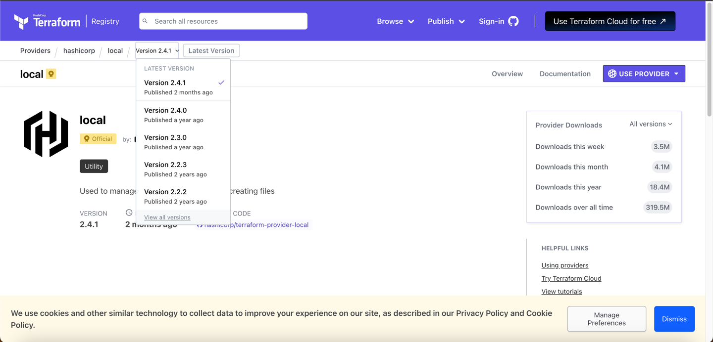
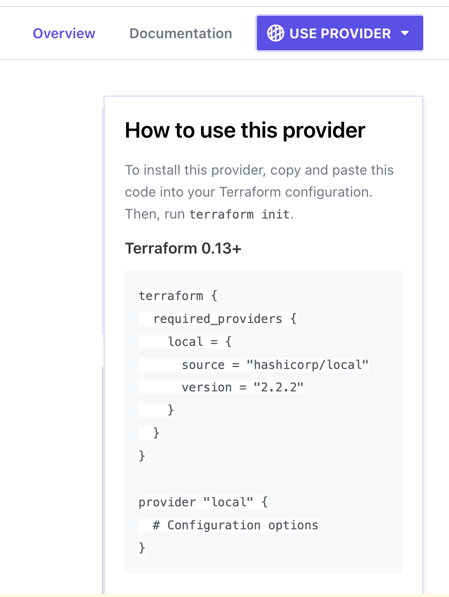

# Version Constraints

```terraform
resource "local_file" "pet" {
    filename = "root/pets.txt"
    content = "We love pets!"
}
```

기본적으로 `terraform init` 명령어 실행 시 테라폼은 가장 최신 버전(latest)의 provider 를 설치한다.

특정 버전을 사용하고 싶다면 **terraform registry** 에서 버전을 확인할 수 있다.




이곳에서 원하는 버전을 선택한 후, 우측 상단 **_USE PROVIDER_** 를 클릭해보자:



다음과 같이 configuration 파일에 `terraform` 블럭을 추가하여 해당 버전을 사용할 수 있다:

```terraform

terraform {
  required_providers {
    local = {
      source = "hashicorp/local"
      version = "2.2.2"
    }
  }
}

resource "local_file" "pet" {
  filename = "root/pets.txt"
  content = "We love pets!"
}
``` 

`terraform` 블럭에서 `required_providers` 를 사용하여 `local` provider 의 버전을 명시했다.

### 특정 버전의 설치를 차단하기

특정 버전의 설치를 차단하고 싶다면, `version` 을 `!=` 로 설정하면 된다:

```terraform
terraform {
  required_providers {
    local = {
      source = "hashicorp/local"
      version = "!= 2.2.2"
    }
  }
}

resource "local_file" "pet" {
  filename = "root/pets.txt"
  content = "We love pets!"
}
```

위와 같이 설정하면, `2.2.2` 버전을 제외한 버전을 설치할 수 있다.

이 외에도 `<`, `<=`, `>`, `>=` 등의 연산자를 사용할 수 있으며, `> 1.2.0, < 2.0.0` 과 같이 범위를 지정할 수도 있다.

### Pessimistic Operator

`~>` 를 사용하여 특정 버전의 마이너 버전을 설치할 수 있다:

예를 들어, `~> 2.2.0` 을 사용하면 `2.2.0` 버전 이상, `2.3.0` **미만**의 버전을 설치할 수 있다.

또, `~> 2.2` 를 사용하면 `2.2.0` 버전 이상, `3.0.0` **미만**의 버전을 설치할 수 있다.

> ![NOTE]
> Pessimistic Operator 는 마이너 버전 업그레이드는 열어두되, 큰 변경사항이 생겨 문제가 생기는 것을 방지하기 위해 사용한다.

