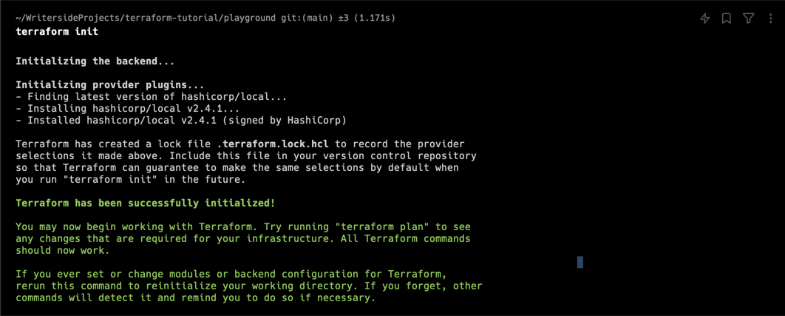
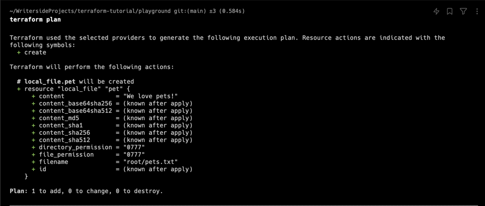
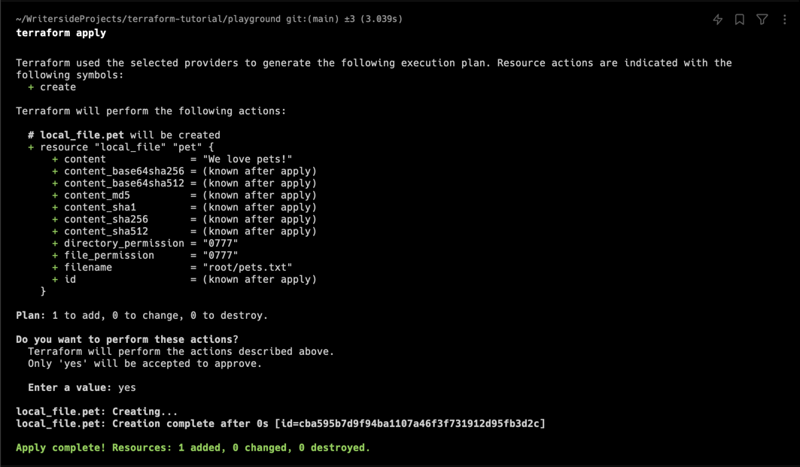
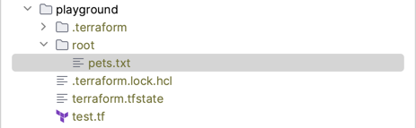

# HCL : HashiCorp Configuration Language

테라폼의 .tf 파일은 HCL 문법으로 구성하는데, 이는 블럭들의 집합으로 구성한다.

HCL 문법은 **Blocks** 와 **Arguments** 으로 이루어져있다.

``` terraform
<block> <parameters> {
    key1 = value1
    key2 = value2
}
```

블럭은 매개변수 집합을 키-값 쌍으로 가진다. 

각각의 매개변수는 configuration data 를 의미한다.

> _블럭은 infrastructure platform의 정보를 포함하며, 플랫폼에서 만들고자 하는 자원들을 정의한다._

다음 예시는 테라폼의 블럭 구조 이해를 돕기 위한 코드이다:
``` terraform
resource "local_file" "pet" {
    filename = "root/pets.txt"
    content = "We love pets!"
}
```

- `resource` : block name
  - 해당 블럭이 resource임을 명시한다.
- `local_file` : resource type
  - resource type 은 두 가지 정보를 포함한다: provider, resource
    - provider 마다 각각의 다른 resource 들을 가진다.
      - provider 예시: local, `aws`, `gcp`, `azure`
      - resource 예시: `iam`, `instance`
    - 언더스코어(`_`)를 기준으로, 왼쪽이 provider, 오른쪽이 resrouce 를 나타낸다. 
    - 해당 예제에서 `local`은 provider, `file`은 resource 를 의미한다.
    - 예제에서는 `local` provider가 제공하는 `file` resource 를 사용한다.
- `pet` : resource name
  - resource 를 식별하기 위한 이름으로, 임의의 문자열을 사용 가능하다.
- `{}` 컬리브라켓 내부의 내용은 arguments 를 나타낸다.
  - arguments 는 resource 에 따라 달라지며, 필수 매개변수와 선택 매개변수가 존재한다.
  - 자원에 따라 지원하는 arguments 를 확인하려면 terraform 도큐멘트를 조회하여 찾아볼 수 있다.

### 예제 해석

  - 해당 예제에서는 `local` provider 의 `file` resource 를 사용하며, 자원의 이름은 `pet` 으로 지정한다.
  - `file` resource 는 파일을 생성하며, 두 개의 매개변수를 받고 있다.
    - filename 매개변수로 파일의 경로와 이름을 지정한다.
    - content 으로 파일 내용을 지정한다.

> `/root` 경로에 _We love pets!_ 내용을 포함하는 `pets.txt` 를 생성한다.

### 실습

실습을 위해, 예제 코드를 실행해본다.


임의의 폴더에 `test.tf` 파일을 생성한 후, 다음의 내용을 입력한다.

``` terraform
resource "local_file" "pet" {
    filename = "root/pets.txt"
    content = "We love pets!"
}
```
  
입력을 마치면 터미널을 열고, 임의의 폴더에서 해당 명령어를 실행한다:

``` Shell
terraform init
```

이 명령어를 통해 테라폼이 필요한 provider plugins 를 다운로드한다. (gradle build와 비슷한 개념)

기대되는 output 은 다음과 같다:



다음으로 해당 명령어를 실행한다:

```Shell
terraform plan
```

명령어를 실행하면 테라폼이 변경 사항을 **계획**한다.

기대되는 output 은 다음과 같다:



어떤 변경사항이 생길지 터미널을 통해 확인할 수 있다.

마지막으로 해당 명령어를 실행한다:

```Shell
terraform apply
```

실제로 테라폼이 변경사항을 수행한다.

명령 수행 후, /root/pets.txt가 생성된걸 확인할 수 있다.

기대되는 output:



실행 후 파일이 생성된 모습:



